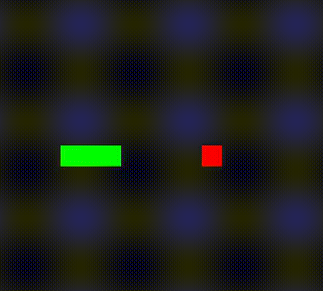

# Q-Learning Snake Game

**C++ based Q-learning approach to the Snake game.**

This project demonstrates reinforcement learning principles through a tabular Q-learning agent that learns to play the classic Snake game. The implementation avoids the use of deep learning frameworks and instead relies on discrete state-action mappings to guide the snake's decisions.

## Features

- Custom environment and game logic in C++
- Heuristic-based fallback decisions
- Epsilon-greedy strategy with decaying exploration
- Q-table serialization for persistent learning
- Collision and reward handling for self and walls

## Demo

Replay of a trained agent:  

## File Structure

1. The environment represents the snake and apple on a grid.
2. The agent observes the relative direction of the apple and possible collisions.
3. A Q-table maps state-action pairs to expected future rewards.
4. The agent selects actions using an epsilon-greedy policy.
5. After each move, the Q-value is updated based on the received reward.
